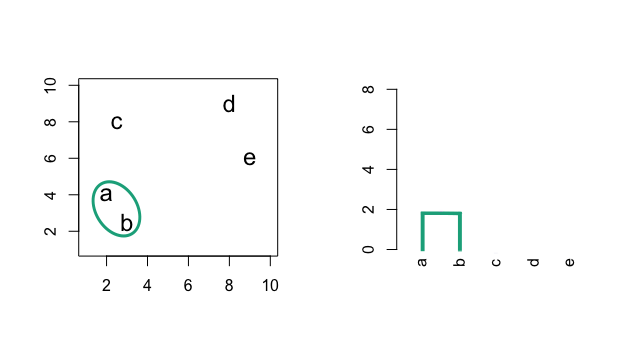

Clustering
========================================================
#author: Matt Wayland
#date: 13 January, 2018
autosize: true
transition: rotate

Clustering
===

Clustering attempts to find groups (clusters) of similar objects. The members of a cluster should be more similar to each other, than to objects in other clusters. Clustering algorithms aim to minimize intra-cluster variation and maximize inter-cluster variation.

Methods of clustering can be broadly divided into two types:

**Hierarchic** techniques produce dendrograms (trees) through a process of division or agglomeration.

**Partitioning** algorithms divide objects into non-overlapping subsets (examples include k-means and DBSCAN)


Hierarchical clustering
========================================================
type: section

========================================================


========================================================



========================================================


========================================================


========================================================


========================================================


========================================================

K-means clustering
========================================================
type: section


DBSCAN
========================================================
type: section

Density-based spatial clustering of applications with noise


Prompt Slide
====================================
type: prompt


Alert Slide
====================================
type: alert

First Slide
========================================================

For more details on authoring R presentations please visit <https://support.rstudio.com/hc/en-us/articles/200486468>.

- Bullet 1
- Bullet 2
- Bullet 3

Slide With Code
========================================================


```r
summary(cars)
```

```
     speed           dist       
 Min.   : 4.0   Min.   :  2.00  
 1st Qu.:12.0   1st Qu.: 26.00  
 Median :15.0   Median : 36.00  
 Mean   :15.4   Mean   : 42.98  
 3rd Qu.:19.0   3rd Qu.: 56.00  
 Max.   :25.0   Max.   :120.00  
```

Slide With Plot
========================================================


