Clustering
========================================================
#author: Matt Wayland
#date: 14 January, 2018
autosize: true
transition: rotate
css: custom.css

Clustering
===

Clustering attempts to find groups (clusters) of similar objects. The members of a cluster should be more similar to each other, than to objects in other clusters. Clustering algorithms aim to minimize intra-cluster variation and maximize inter-cluster variation.

Methods of clustering can be broadly divided into two types:

- **Hierarchic** techniques produce dendrograms (trees) through a process of division or agglomeration.

- **Partitioning** algorithms divide objects into non-overlapping subsets (examples include k-means and DBSCAN)


========================


Distance metrics
========================================================
type: section

Euclidean distance
========================================================


Hierarchic agglomerative
========================================================
type: section


========================================================
Building a dendrogram
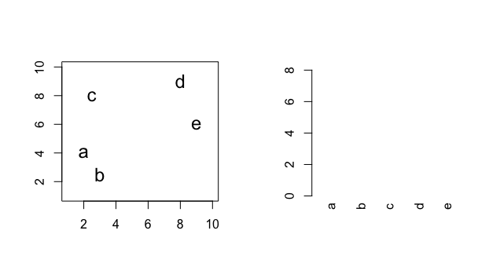

========================================================
Building a dendrogram continued


========================================================
Building a dendrogram continued
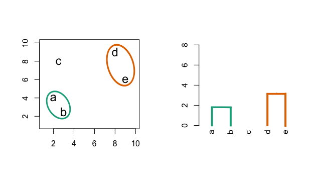

========================================================
Building a dendrogram continued
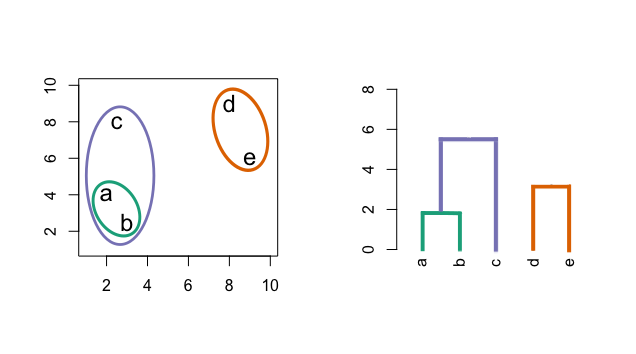

========================================================
Building a dendrogram continued
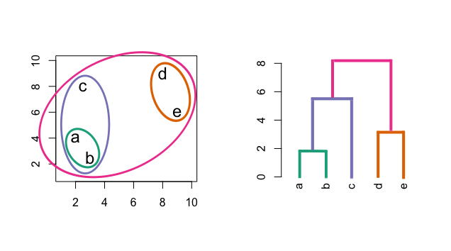

========================================================
Building a dendrogram continued


========================================================

Linkage algorithms
========================================================
type: sub-section


========================================================


Distance matrix


|   |A  |B  |C  |D  |
|:--|:--|:--|:--|:--|
|B  |2  |   |   |   |
|C  |6  |5  |   |   |
|D  |10 |10 |5  |   |
|E  |9  |8  |3  |4  |


Merge distances


|Groups        | Single| Complete| Average|
|:-------------|------:|--------:|-------:|
|A,B,C,D,E     |      0|        0|     0.0|
|(A,B),C,D,E   |      2|        2|     2.0|
|(A,B),(C,E),D |      3|        3|     3.0|
|(A,B)(C,D,E)  |      4|        5|     4.5|
|(A,B,C,D,E)   |      5|       10|     8.0|

==================================


Hierarchical clustering examples
====================================
type: prompt

- Clustering synthetic data sets (6.3.2)
- Gene expression profiling of human tissues (6.3.3)


K-means clustering
========================================================
type: section

Algorithm
========================================================
**Pseudocode for the K-means algorithm**

```
randomly choose k objects as initial centroids
while true:

1. create k clusters by assigning each object to closest centroid

2. compute k new centroids by averaging the objects in each cluster

3. if none of the centroids differ from the previous iteration: return the current set of clusters
```


K-means clustering examples
====================================
type: prompt

- Clustering synthetic data sets (6.4.4)
- Gene expression profiling of human tissues (6.4.5)

Randomly choose initial centroids
===================================

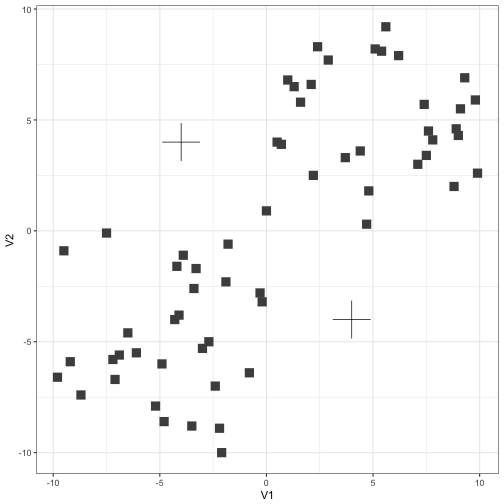

First iteration
========================================================


***


Second iteration
========================================================

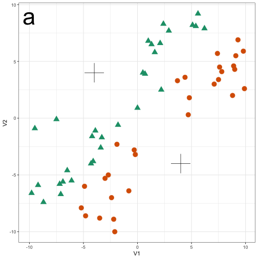
***
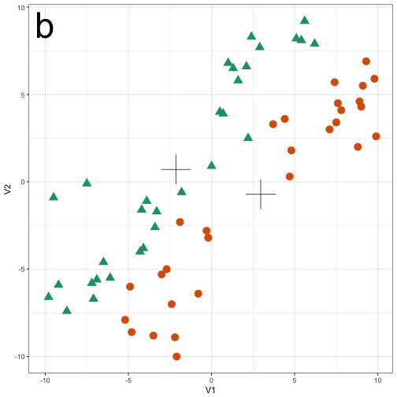

Third iteration
========================================================

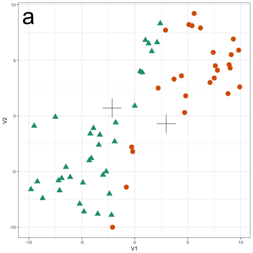
***
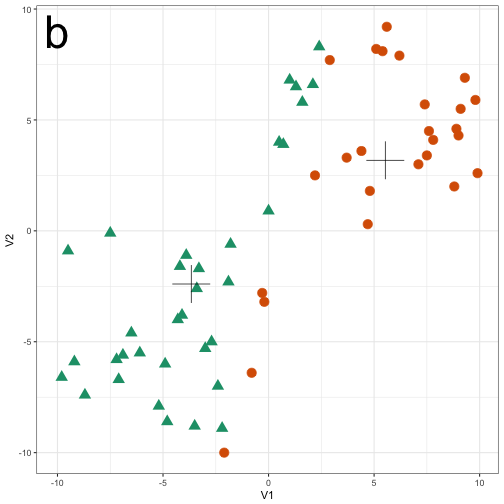

Fourth and final iteration
========================================================

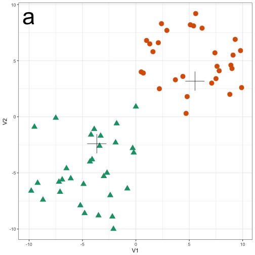
***
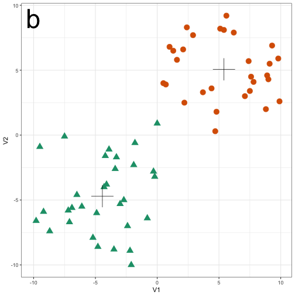

DBSCAN
========================================================
type: section

Density-based spatial clustering of applications with noise


DBSCAN examples
====================================
type: prompt

- Clustering synthetic data sets (6.5.4)
- Gene expression profiling of human tissues (6.5.5)


Prompt Slide
====================================
type: prompt


Alert Slide
====================================
type: alert

First Slide
========================================================

For more details on authoring R presentations please visit <https://support.rstudio.com/hc/en-us/articles/200486468>.

- Bullet 1
- Bullet 2
- Bullet 3

Slide With Code
========================================================


```r
summary(cars)
```

```
     speed           dist       
 Min.   : 4.0   Min.   :  2.00  
 1st Qu.:12.0   1st Qu.: 26.00  
 Median :15.0   Median : 36.00  
 Mean   :15.4   Mean   : 42.98  
 3rd Qu.:19.0   3rd Qu.: 56.00  
 Max.   :25.0   Max.   :120.00  
```

Slide With Plot
========================================================


